# OMW 本機使用手冊

> [!IMPORTANT]
> `@sevenflanks/omw` 尚未確認已發布至 public npm registry。本手冊目前只使用此 repository 產生的 local package artifact；請勿把 `npx @sevenflanks/omw` 當成已驗證的安裝方式。
> 本手冊描述日常／configured product flow，會使用 `%LOCALAPPDATA%\OMW`。Repository development 不可照抄
> 下列裸 `omw` 命令；請改用 `npm run dev:credentials`、`npm run dev` 或
> `npm run dev:omw -- ...`，避免連入日常 data、credentials 與 OpenCode DB。

OMW（OpenCode Manager Web）是在 Windows 本機啟動的管理介面，用來檢視 Project、OpenCode Instance 與 Session，並啟動 OMW 管理的背景 Instance。OMW 維持 loopback-only；需要從手機連線時，由 operator 另外設定 Tailscale Serve。

本手冊對應目前的 local package 介面：

```text
omw
omw opencode [project] [-s session]
```

原生 `opencode` 命令不會被 OMW 改寫、攔截或自動接管。只有透過 `omw opencode ...` 啟動時，OMW wrapper 才會嘗試啟動或重用 Manager、保留執行個體的固定連線埠並登錄追蹤資訊。

## How OMW Works

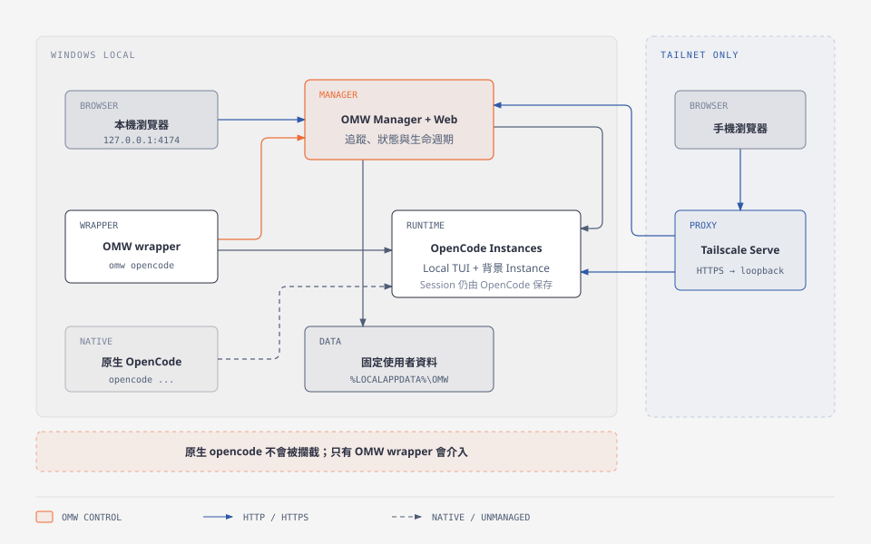

[HTML source](diagrams/omw-architecture.html)

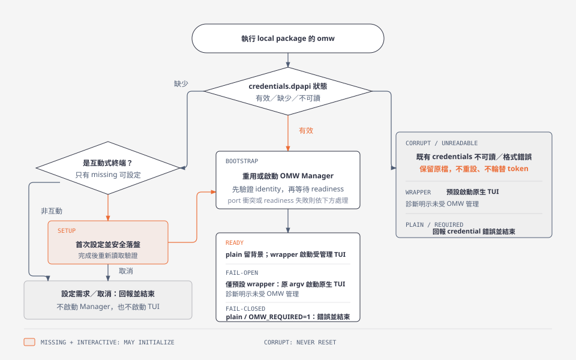

[HTML source](diagrams/omw-startup-flow.html)

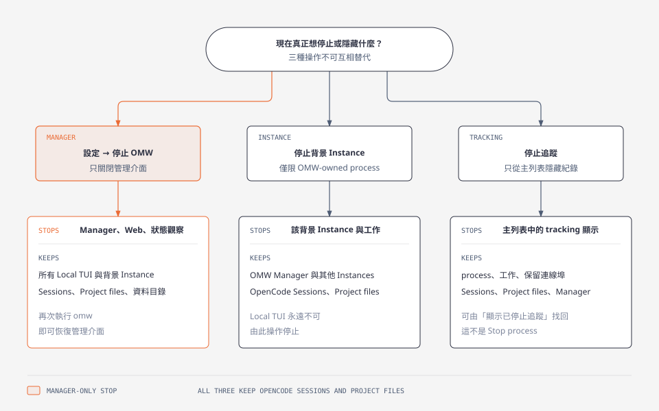

[HTML source](diagrams/omw-stop-semantics.html)

三張圖是由同目錄的靜態 HTML source 匯出，方便 GitHub 直接顯示；它們不代表已完成真實 UI 或手機驗收。

## Prerequisites

目前的 local onboarding 需要：

- Windows 11，並以日常使用 OMW 的同一個 Windows 帳號操作。
- Node.js 24 以上與 npm。
- 已安裝 OpenCode CLI。
- 本 repository 的本機 checkout；以下命令必須從 repository root 執行。

OMW 不會安裝 OpenCode，也不會修改 `PATH`。如果 `opencode.exe` 不在 `PATH`，請先找出可信任的實際執行檔，並在目前 PowerShell 視窗明確設定：

```powershell
$env:OMW_OPENCODE_EXECUTABLE = 'C:\path\to\opencode.exe'
```

此值必須是絕對路徑、存在且為一般檔案。OMW 不會掃描整顆磁碟，也不會任意猜測 shim。若沒有設定，OMW 只會依序查看已知安裝提示與 `PATH`；它也會拒絕解析回 OMW launcher 自己，避免遞迴啟動。

## Quick Start

### 建立 local package artifact

在 repository root 開啟 PowerShell：

```powershell
npm ci
$packageDir = Join-Path $env:TEMP 'omw-local-package'
New-Item -ItemType Directory -Force -Path $packageDir | Out-Null
$packageName = npm pack --pack-destination $packageDir -w @sevenflanks/omw | Select-Object -Last 1
$omwPackage = Join-Path $packageDir $packageName
```

`$omwPackage` 直接使用 `npm pack` 實際輸出的檔名，不依賴寫死的 package version。

`npm pack` 會先建置 workspace，並將以下 runtime 內容放入 artifact：

- OMW Manager server。
- OMW Web 靜態資源。
- `omw` 與 `omw-opencode` launcher。
- Windows DPAPI 與 process control helper。

這個 `.tgz` 才是下列命令的 package 來源。清除 npm cache 或刪除 artifact 後，未來再次啟動前需重新執行 `npm pack`；OMW 的持久資料不放在 artifact 或 npm cache 中。

### 第一次啟動

執行 plain `omw`：

```powershell
npm exec --yes --package="$omwPackage" -- omw
```

第一次執行時，互動式終端會要求：

1. OMW 使用者名稱，預設是 `omw`。
2. 至少 16 個字元的密碼。
3. 再輸入一次密碼確認。

OMW 會自動產生 launcher token，並將帳密與 token 透過 Windows current-user DPAPI 保護後保存。請勿把密碼、launcher token 或 `credentials.dpapi` 內容貼到文件、Issue、log 或截圖中。

成功後，終端應顯示類似：

```text
OMW Manager ready: http://127.0.0.1:4174
```

plain `omw` 只會初始化、重用或在背景啟動 Manager，不會啟動 OpenCode TUI。請用瀏覽器開啟終端實際輸出的 URL。

#### 取消與重試

在首次設定按 `Ctrl+C` 時，預期訊息是：

```text
OMW 初始化已取消，可直接重試。
```

取消會直接結束，不會偷偷改成啟動未受管理的 OpenCode。重新執行同一個 plain `omw` 命令即可重試。

若在沒有既有設定的非互動環境執行，OMW 會要求先回到本機互動式終端：

```text
缺少 OMW 初始設定；請先在本機互動式終端執行 omw。
```

#### 日常重跑與冪等性

之後每天可執行同一個 plain `omw` 命令。OMW 會以 launcher token 驗證 `127.0.0.1:<port>` 上的 Manager identity：

- 身分是 `omw-manager` 且 protocol version 相符時，重用現有 Manager。
- Manager 不存在時，以背景 process 啟動，並等待 readiness。
- 同時執行多次時，由初始化與啟動 lock 加上第二次 identity 檢查避免重複初始化或重複 Manager。
- 重用不會重設帳密、不會輪替 launcher token，也不會清空 SQLite。

## Usage

### 透過 OMW wrapper 啟動 OpenCode

在要工作的 Project 目錄執行：

```powershell
npm exec --yes --package="$omwPackage" -- omw opencode
```

沒有提供 `[project]` 時，wrapper 使用目前工作目錄。也可以明確提供 Project 路徑：

```powershell
npm exec --yes --package="$omwPackage" -- omw opencode 'C:\develop\projects\example'
```

要開啟特定 OpenCode Session：

```powershell
npm exec --yes --package="$omwPackage" -- omw opencode 'C:\develop\projects\example' -s '<session-id>'
```

Wrapper 會保留呼叫時的 cwd、Project 與原始 OpenCode arguments。它只補上缺少的 loopback hostname 與 OMW 保留的固定 port，再啟動 OpenCode TUI。

直接執行下列命令仍是原生 OpenCode，不會出現在 OMW 的受管理流程中：

```powershell
opencode
```

這是刻意的邊界，不是安裝失敗。OMW 不會建立全域 shim，也不會把 `opencode` 替換成 wrapper。

#### Wrapper bootstrap failure

若 wrapper 無法啟動或連上 Manager，預設會顯示診斷，然後用原始 argv 與環境啟動 native OpenCode。這個 TUI 是未受 OMW 管理的執行個體；請不要把 fail-open 誤認為 Manager 已恢復。

需要「Manager 不可用就不要啟動 OpenCode」時，在同一個 PowerShell 視窗設定：

```powershell
$env:OMW_REQUIRED = '1'
npm exec --yes --package="$omwPackage" -- omw opencode
```

`OMW_REQUIRED=1` 會讓任何 bootstrap failure 直接結束。未設定 `OMW_REQUIRED=1` 時，首次設定缺失或使用者取消初始化仍不會 fail-open；既有 credentials 損毀、DPAPI 無法解密或其他 Manager bootstrap failure 則會顯示診斷並啟動未受管理的 native OpenCode。

### 使用 Web 管理介面

> [!NOTE]
> 以下畫面證據皆為：**正式 Vue UI，隔離 mock backend，非真 Manager/Tailnet實測**。圖片用來說明操作位置與預期畫面，不代表真實 process、credentials、Session、手機或網路已通過。

#### Overview 與 Instance 清單

Overview 顯示 OMW 已知的 Project 與 Instance。狀態來自觀察與 probe：

- 可連線代表目前 probe 成功。
- `Unreachable` 只代表 OMW 目前無法連線，不等於 process 已停止。
- 直接用 native `opencode` 啟動的 TUI 不保證被 OMW 追蹤。
- 已停止追蹤的項目預設隱藏，可使用 `顯示已停止追蹤` 檢視。

**用途：**辨識 Instance 清單、目前狀態與選取後的 detail。

**步驟：**開啟 Overview，選取一個合成 fixture Instance。
**預期結果：**左側保留 Project／Instance 層級，右側顯示 Primary Session 與狀態摘要。

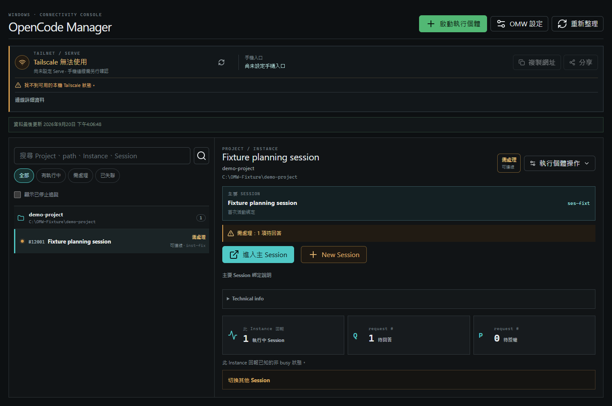

#### 啟動背景 Instance

從 `啟動執行個體` 開啟 launch panel，選擇或輸入 Project 後啟動。這種 Instance 是 Manager-launched Headless Instance，與 wrapper 啟動的 Local TUI Instance 不同；只有前者可以從 Web 執行 `停止執行個體`。

啟動後，先確認清單中的 Project、port 與狀態，再開啟 detail。不要只看清單列存在就判定 OpenCode 已 ready。

**用途：**確認按建立前的 Project 目錄與啟動控制。

**步驟：**按 `啟動執行個體`，輸入測試目錄並按 `瀏覽`；此圖停在按 `啟動全新 Instance` 之前。
**預期結果：**畫面顯示選定目錄與 `啟動全新 Instance`；截圖當下未送出 create request。

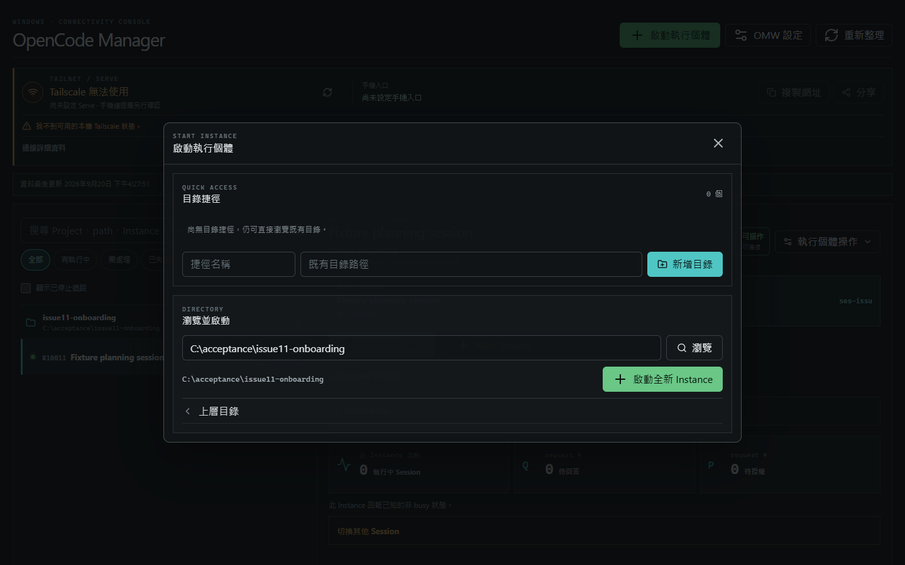

**用途：**說明建立成功後的 UI 落點。

**步驟：**在隔離 create mock 情境送出 fixture 目錄。
**預期結果：**成功通知出現，detail 切換至新 Instance；這不是同一次真實 Manager 建立的連續證據。

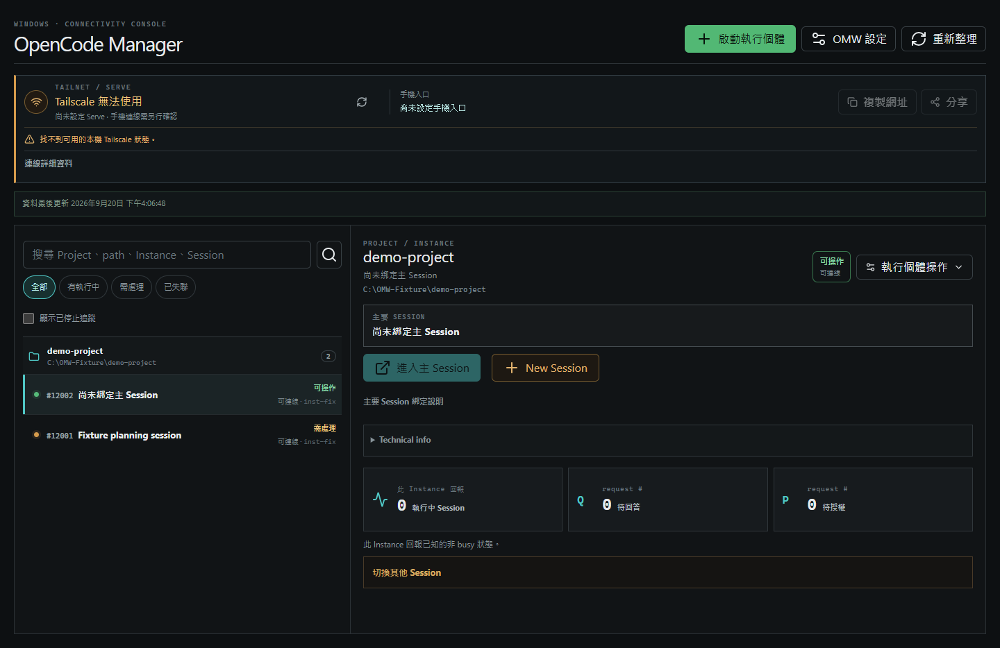

#### Session 與 Primary Session Binding

Instance detail 中的操作語意如下：

- `進入主 Session`：開啟目前 Primary Session Binding 指向的 Main Session。
- `New Session`：確認後建立新 OpenCode Session、把它設成新的 Primary Session Binding，並開啟 OpenCode Web。
- `切換其他 Session`：展開既有 Session 歷史。
- 直接點選歷史 Session：開啟該 Session，但不改 Primary Session Binding。
- `切換並開啟`：明確把選定 Session 設為新的 Primary Session Binding，再開啟。

OMW 管理的是 binding 與入口；Session 內容仍由 OpenCode 保存。停止 OMW、停止追蹤或停止背景 Instance 都不會刪除 OpenCode Session。

**用途：**辨識 Primary Session 與其他 Session 的層級。

**步驟：**在 Instance detail 展開 `切換其他 Session`，再載入 child Session。
**預期結果：**主 Session、歷史 Session 與 child Session 層級可辨識。

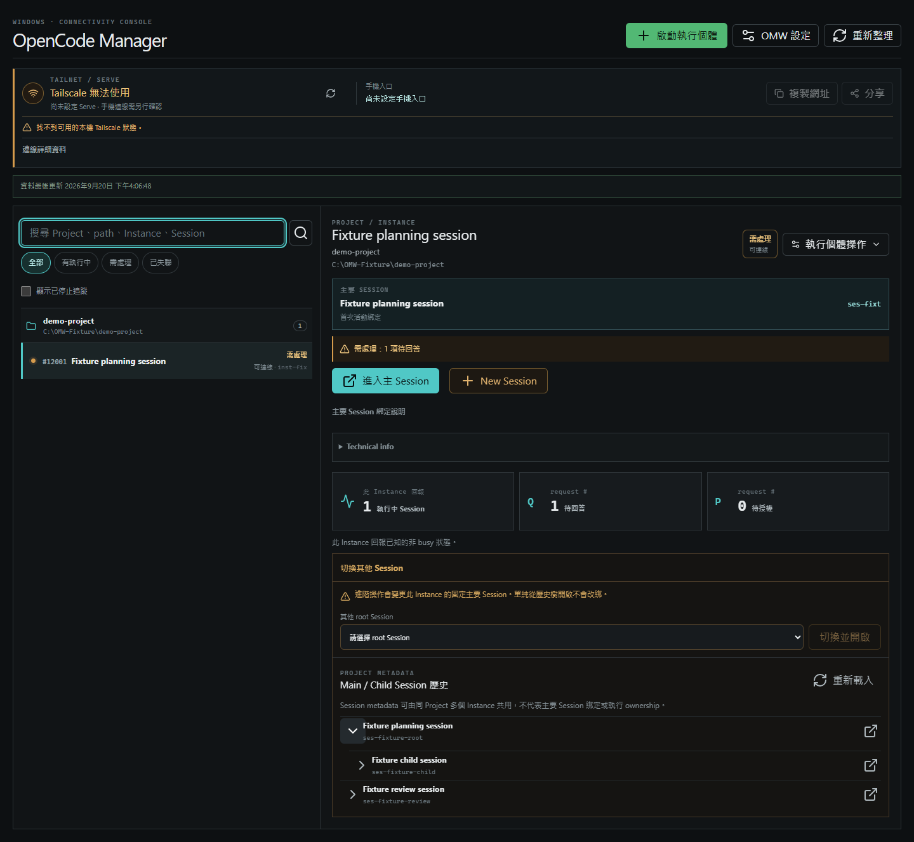

### 修改 OMW 帳號與密碼

> [!NOTE]
> **正式 Vue UI，隔離 mock backend，非真 Manager/Tailnet實測**。以下圖片沒有驗證 DPAPI persistence、新帳密登入或舊帳密失效。

開啟 `OMW 設定` → `修改 OMW 帳號與密碼`，輸入：

1. 目前密碼。
2. 新使用者名稱。
3. 至少 16 個字元的新密碼。
4. 送出 `更新帳密`。

更新流程會先驗證目前密碼，先把新 DPAPI payload 寫入成功，再切換執行中的驗證資料。如果寫入失敗，舊帳密仍維持有效。

更新帳密不會：

- 輪替 launcher token。
- 變更資料目錄。
- 清除 SQLite。
- 刪除 OpenCode Session 或 Project files。

遠端瀏覽器需使用新帳密重新登入。不要在截圖中顯示任一密碼欄位內容。

**用途：**辨識 credential rotation 欄位與送出控制。

**步驟：**開啟 `OMW 設定`，停在尚未輸入密碼的畫面。
**預期結果：**目前密碼、新密碼與確認欄位均為空白，且不顯示 launcher token。

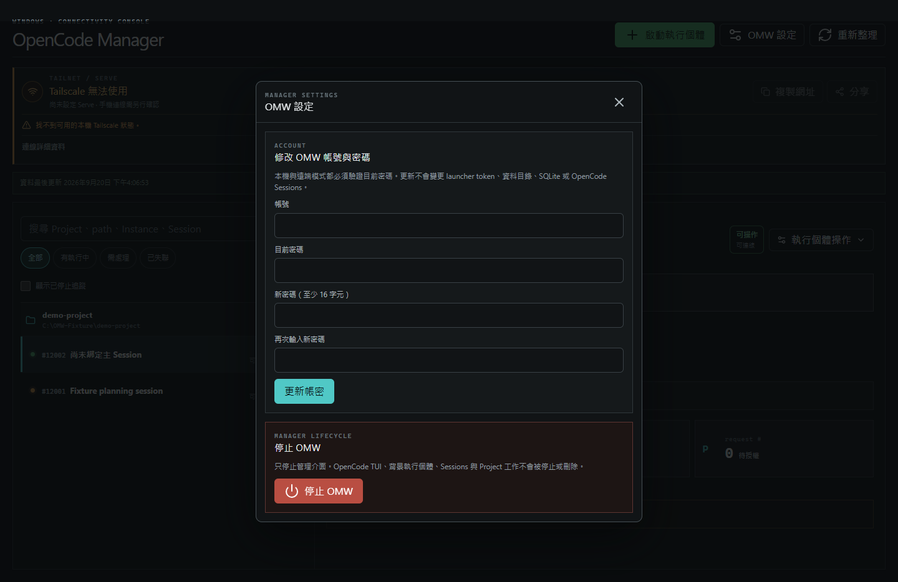

**用途：**說明前端收到 HTTP `204` 後的完成狀態。

**步驟：**以合成 credential 送出隔離 mock request。
**預期結果：**成功通知出現，三個密碼欄位清空；不代表新帳密已寫入或可登入真 Manager。

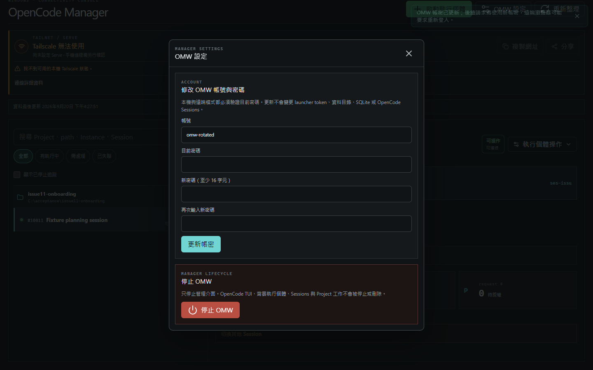

### 三種停止操作

> [!NOTE]
> **正式 Vue UI，隔離 mock backend，非真 Manager/Tailnet實測**。以下停止畫面不代表任何真實 Manager 或 OpenCode process 已停止或保留。

這三個操作完全不同；執行前先確認真正想影響的範圍。

| 操作 | 會停止或隱藏 | 一定保留 |
| --- | --- | --- |
| `OMW 設定` → `停止 OMW` → `只停止 OMW` | Manager、Web 管理介面、OMW-owned observers 與 SQLite 連線 | 所有 OpenCode Local TUI、背景 Instances、Sessions、Project files、持久資料 |
| `執行個體操作` → `停止執行個體` | 該 Manager-owned 背景 Instance 與其中進行中的工作 | Manager、其他 Instances、OpenCode Sessions、Project files；Local TUI 不允許由此停止 |
| `執行個體操作` → `停止追蹤` | 只把 OMW tracking record 從預設清單隱藏 | process、工作、reserved port、Sessions、Project files、Manager |

#### 停止 OMW

管理介面會立即斷線，但 OpenCode 工作繼續。之後重新執行 plain `omw` 即可重建 Manager 管理介面並重用既有資料。

**用途：**在送出前核對停止範圍。

**步驟：**開啟 `OMW 設定`，按 `停止 OMW`，停在 confirmation。
**預期結果：**標題為「停止 OMW Manager？」且文案明示 OpenCode TUI、背景 Instance、Sessions 與 Project 工作繼續。

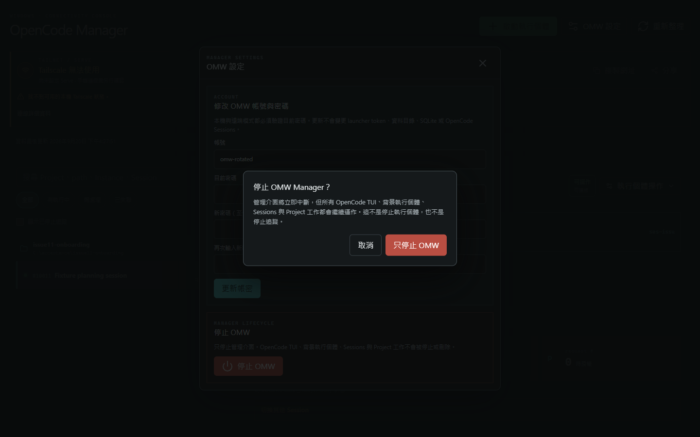

**用途：**說明前端收到 mock HTTP `202` 後的 stopped banner。

**步驟：**在隔離 mock 情境按 `只停止 OMW`。
**預期結果：**管理介面顯示 OMW Manager 已停止；不代表真 process shutdown 已完成。

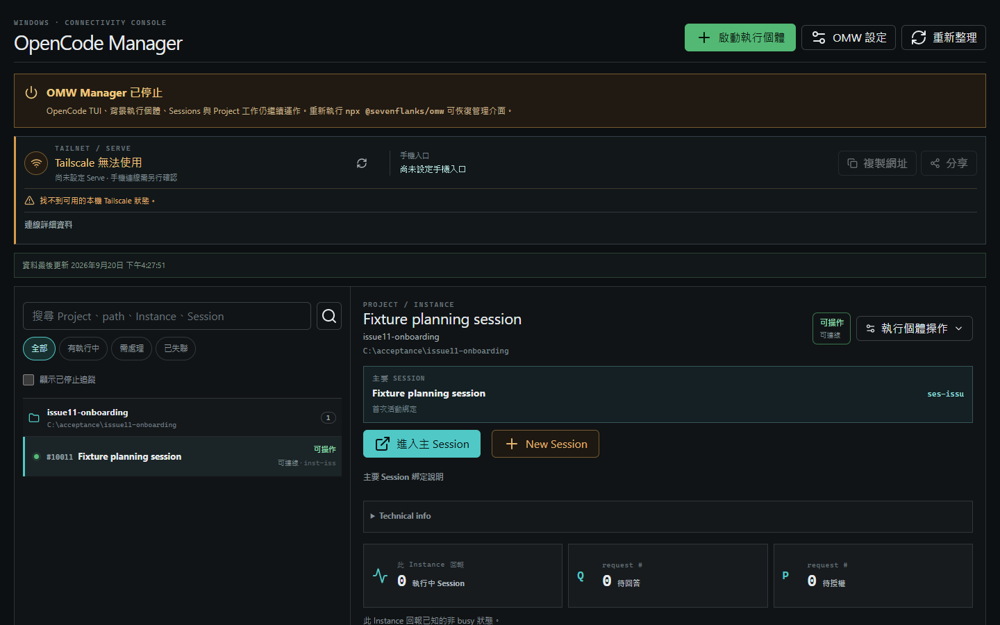

#### 停止執行個體

這是真正的 process stop，只提供給 OMW 有 ownership 且允許停止的背景 Instance。Local TUI 的 process ownership 留在使用者的終端，因此 Web 不會代替使用者終止它。

#### 停止追蹤

這不是 process stop。被隱藏的 process 仍可能佔用同一個 fixed port；若要再次檢視，先開啟 `顯示已停止追蹤`。不要因為主清單看不到就嘗試啟動同 port 的替代 process。

## Configuration

### 資料位置與保留規則

預設資料目錄固定為：

```text
%LOCALAPPDATA%\OMW
```

它不受目前工作目錄、repository 位置、`.tgz` 位置或 npm cache 位置影響。目錄內包含 OMW credentials、launcher token 與 SQLite 等持久資料；OpenCode Session 與 Project files 仍由 OpenCode / Project 自己保存。

只有明確設定 `OMW_DATA_DIR` 才會改用其他位置：

```powershell
$env:OMW_DATA_DIR = 'D:\private\omw-data'
```

這是改用另一個資料根目錄，不是自動搬移。不要為了排除啟動問題刪除或覆寫既有 `%LOCALAPPDATA%\OMW`；也不要把舊 `.omw` 目錄當成新版本要自動搬移的資料來源。

如果使用 override，plain `omw` 與每一次 wrapper 命令都必須使用同一個 `OMW_DATA_DIR`，否則會看到不同的 OMW 狀態。

### Tailnet 與手機存取

OMW server 仍只綁定 loopback。OMW 不會代替 operator 設定：

- Tailscale Serve。
- Windows Firewall。
- Tailnet ACL 或 device policy。
- Funnel 或任何 public internet ingress。

每一個 Manager / OpenCode port 都需要 operator 核對「Tailnet HTTPS URL → 同一個 `127.0.0.1:<port>`」的固定映射。請依序閱讀：

- [Tailnet access runbook](security/tailnet-access.md)
- [Mobile acceptance checklist](security/mobile-acceptance.md)
- [Launcher and authentication contract](security/launcher-contract.md)

不要用「Tailnet 設定看起來正確」或模擬 viewport 代替真實手機驗收。手機清單、detail、Session navigation、帳密與 stop confirmation 只有經實機確認後才能宣稱通過。使用者已明確同意將真手機與 Tailnet 驗收移出 Issue #11 本輪 PR 的必要條件；它們仍是未驗證的後續驗收項目，目前狀態見[驗收證據](#validation-status)。

> [!NOTE]
> **正式 Vue UI，隔離 mock backend，非真 Manager/Tailnet實測**。以下是 Playwright `390 × 844` viewport，不是觸控或實機證據。

**用途：**確認 mobile list 與水平版面。

**步驟：**以 `390 × 844` viewport 開啟 Overview，從 detail 按 `返回列表`。
**預期結果：**回到 Instance list，detail 隱藏，頁面沒有水平 overflow。

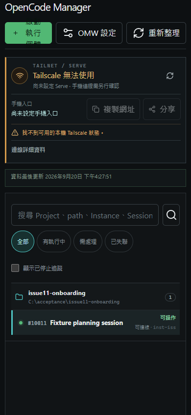

**用途：**確認從 list 進入 mobile detail。

**步驟：**在 mobile list 點選 fixture Instance。
**預期結果：**切換至 detail 並顯示 `返回列表`；此 click-based 路徑不代表 browser back gesture 或真手機已通過。

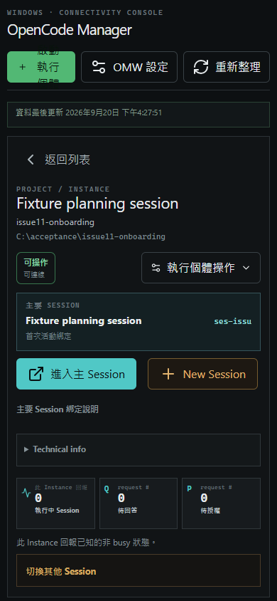

## Troubleshooting

### Local package 找不到或 public npx 失敗

目前不要執行未驗證的 `npx @sevenflanks/omw`。回到 repository root 重新執行 `npm pack`，確認 `$omwPackage` 指向實際存在的 `.tgz`，再使用：

```powershell
npm exec --yes --package="$omwPackage" -- omw
```

### 找不到 OpenCode executable

先在 PowerShell 執行：

```powershell
Get-Command opencode
```

如果找不到，確認 OpenCode 已安裝；若已知可信任的 `opencode.exe` 路徑，設定 `OMW_OPENCODE_EXECUTABLE`。OMW 不會修改 `PATH`，也不會自動安裝或全磁碟搜尋。

### 4174 或指定 port 已被其他程序使用

若 identity probe 判定 listener 不是 OMW Manager，OMW 會明確失敗，訊息包含：

```text
127.0.0.1:<port> 已由非 OMW Manager 程序使用；不會停止或取代該程序。
```

先由 operator 確認該 listener 的 owner，再自行決定是否改用其他 `OMW_PORT` 或停止 owner。OMW 不會猜 PID、殺掉未知程序或取代 listener。

### Manager readiness 或連線失敗

- plain `omw`：回報錯誤並結束；它不會啟動 TUI。
- `omw opencode ...`：預設顯示 bootstrap failure 診斷並啟動 native OpenCode；此 TUI 是 unmanaged。
- `OMW_REQUIRED=1`：wrapper 回報錯誤並結束，不啟動 native OpenCode。
- 若本次剛建立的背景 Manager readiness 失敗，launcher 只清理本次自己建立的 process object，不會依 port 或猜測的 PID 停止其他程序。

### Web 顯示 Unreachable

`Unreachable` 不是停止證據。依序確認 process 是否仍在、fixed port 是否仍由同一個 Instance 監聽，以及 Tailnet Serve 是否映射到同一個 loopback port。不要直接按 `停止追蹤` 來修復連線；那只會隱藏紀錄。

### 看到「continuing with native OpenCode」

這是 wrapper 的明示 fail-open，不是成功接管。OpenCode 可以繼續使用，但 OMW 不保證能追蹤這次 TUI。需要強制受管理時，修正 Manager 問題後使用 `OMW_REQUIRED=1` 重試。

## Reference

### Validation Status

#### 目前證據

| 項目 | 狀態 | 證據或限制 |
| --- | --- | --- |
| Local package 建置、pack 與本機安裝 | VERIFIED／人工 PASS（2026-09-20） | `npm pack -w @sevenflanks/omw` 成功，artifact manifest 為 `@sevenflanks/omw@0.1.0`；使用者另回報 local package 本機安裝 PASS |
| Local `.tgz` 的 `omw` bin resolution | VERIFIED（2026-09-20） | `npm exec --package=<local-tgz> -- omw __docs_probe__` 進入目前 CLI 並回報預期 unknown-command 診斷 |
| Public npm registry publication / scope ownership | NOT VERIFIED | 本輪未發布 package，也未查 public registry ownership |
| Public `npx @sevenflanks/omw` end-to-end | NOT VERIFIED | 本手冊刻意不把它列為可執行步驟 |
| Manager 初始化與返回終端 | 人工 PASS（2026-09-20） | 使用者依人工隔離環境 guide，在一般 `pwsh` 完成初始化並確認控制權返回終端；不是 agent synthetic PTY 重跑 |
| Wrapper 啟動真實 OpenCode TUI | 人工 PASS（2026-09-20） | cwd、cwd + `-s target`、指定 Project + `-s target` 與 `Ctrl+C` 均由使用者親自驗收通過 |
| Web 登錄、Manager-only shutdown 與 restart | 人工 PASS（2026-09-20） | cwd TUI 可在 Web 登錄；`stopManager` 後 TUI 仍可操作；restart 後 target 保留；測試 TUI 與 Manager 均已停止 |
| 歷史 synthetic PTY harness | NOT_PROVEN | harness 在 resume 前遇到 `AssignProcessToJobObject failed with Win32 error 5`；此歷史結果不改寫，人工驗收另行補足 user-observable 路徑 |
| Web UI 桌面 walkthrough | MOCK UI VERIFIED／REAL NOT VERIFIED | [Issue #11 UI acceptance report](acceptance/issue11-ui-acceptance-2026-09-20.md) 已保存正式 Vue UI + 隔離 mock backend 證據；未連真 Manager |
| Tailnet / 真實手機 | NOT VERIFIED／本輪非 blocker | 配置文件與模擬 viewport 不能替代實機 probe；使用者已同意移出 Issue #11 本輪 PR 必要條件 |
| 個人既有 OpenCode 設定 | NOT VERIFIED | 人工驗收使用隔離環境，未驗個人既有設定、plugin、Session 或資料相容性 |
| Release artifact / Product walkthrough version | NOT VERIFIED | 人工驗收使用本機未提交 worktree；既有 artifact SHA 未知，`0.1.0` manifest 不等於 release 驗證 |
| 人工驗收日期 | 2026-09-20 | 只記錄日期，不推測確切時間或 pack hash |

Bin resolution probe 只證明 local artifact 與 bin entry 可用。另見 [Issue #11 人工本機驗收報告](acceptance/issue11-manual-local-acceptance-2026-09-20.md)，其 PASS 來自使用者在一般 `pwsh` 親自執行，不是 agent 重跑，也不證明 release artifact、個人既有 OpenCode 設定、Tailnet 或真手機路徑。

#### 正式 Vue UI mock 截圖狀態

**正式 Vue UI，隔離 mock backend，非真 Manager/Tailnet實測**。十張圖已放入上方對應操作章節；完整 route、status、request 與 lifecycle 證據見 [Issue #11 UI acceptance report](acceptance/issue11-ui-acceptance-2026-09-20.md)。

| 場景 | Mock UI 狀態 | 真實驗收狀態 |
| --- | --- | --- |
| Overview / Instance detail | VERIFIED | 真 Manager、SQLite 與真 Instance 未驗證 |
| Session tree | VERIFIED | 真 OpenCode Session/provider 未驗證 |
| Launch panel / create result | VERIFIED（分開的 mock 證據） | 真 Manager 建立與 readiness 未驗證 |
| Credential form / success | VERIFIED | DPAPI persistence、新舊帳密行為未驗證 |
| Stop confirmation / stopped banner | VERIFIED | 真 Manager shutdown 與 OpenCode process 保留未驗證 |
| Mobile list / detail / list | VERIFIED（模擬 viewport） | 真手機、touch、Tailnet 與 browser back gesture 未驗證 |

#### 仍缺或不在本輪的驗收

- Credential 更新後新帳密可用、舊帳密拒絕、launcher token 保留與 persistence failure rollback。
- 個人既有 OpenCode 設定、plugin、Session 與資料相容性。
- 可對應 commit、tag、SHA 或正式發布 artifact 的 release 驗證；本機未提交版本不宣稱已完成此項。
- Public npm registry publication 與 `npx @sevenflanks/omw` end-to-end。

真手機經 Tailnet／Tailscale Serve 的 list/detail、touch、back gesture、Session navigation、帳密與 stop confirmation 仍是 `NOT VERIFIED`，但使用者已明確同意移出 Issue #11 本輪 PR 必要條件。上方 desktop 與 `390 × 844` mobile viewport 證據維持有效；它們不代表真手機或 Tailnet 已通過。

### Further Reading

- [Domain model](agents/domain.md)
- [Issue tracker workflow](agents/issue-tracker.md)
- [Launcher and authentication contract](security/launcher-contract.md)
- [Tailnet access runbook](security/tailnet-access.md)
- [Mobile acceptance checklist](security/mobile-acceptance.md)
- [Technical Reference](reference.md)
